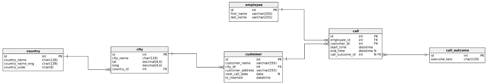
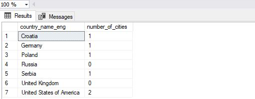

# Laboratorio 6 - Consultas y Joins de SQL

Tabla: **salesman**

```sql
 salesman_id |    name    |   city   | commission 
-------------+------------+----------+------------
        5001 | James Hoog | New York |       0.15
        5002 | Nail Knite | Paris    |       0.13
        5005 | Pit Alex   | London   |       0.11
        5006 | Mc Lyon    | Paris    |       0.14
        5007 | Paul Adam  | Rome     |       0.13
        5003 | Lauson Hen | San Jose |       0.12
```

Tabla: **customer**

```sql
customer_id |   cust_name    |    city    | grade | salesman_id 
-------------+----------------+------------+-------+-------------
        3002 | Nick Rimando   | New York   |   100 |        5001
        3007 | Brad Davis     | New York   |   200 |        5001
        3005 | Graham Zusi    | California |   200 |        5002
        3008 | Julian Green   | London     |   300 |        5002
        3004 | Fabian Johnson | Paris      |   300 |        5006
        3009 | Geoff Cameron  | Berlin     |   100 |        5003
        3003 | Jozy Altidor   | Moscow     |   200 |        5007
        3001 | Brad Guzan     | London     |       |        5005
```

Tabla: **orders**

```sql
ord_no      purch_amt   ord_date    customer_id  salesman_id
----------  ----------  ----------  -----------  -----------
70001       150.5       2012-10-05  3005         5002
70009       270.65      2012-09-10  3001         5005
70002       65.26       2012-10-05  3002         5001
70004       110.5       2012-08-17  3009         5003
70007       948.5       2012-09-10  3005         5002
70005       2400.6      2012-07-27  3007         5001
70008       5760        2012-09-10  3002         5001
70010       1983.43     2012-10-10  3004         5006
70003       2480.4      2012-10-10  3009         5003
70012       250.45      2012-06-27  3008         5002
70011       75.29       2012-08-17  3003         5007
70013       3045.6      2012-04-25  3002         5001
```

1. Escriba una declaración SQL** para preparar una lista con el nombre del vendedor, el nombre del cliente y sus ciudades para los vendedores y clientes que pertenecen a la misma ciudad.

**Solución**

```sql
SELECT salesman.name AS "Salesman",
customer.cust_name, customer.city 
FROM salesman,customer 
WHERE salesman.city=customer.city;
```

**Resultado de la consulta:**

```
Salesman	cust_name	city
James Hoog	Nick Rimando	New York
James Hoog	Brad Davis	New York
Pit Alex	Julian Green	London
Mc Lyon		Fabian Johnson	Paris
Nail Knite	Fabian Johnson	Paris
Pit Alex	Brad Guzan	London
```

2. Escriba una declaración SQL para encontrar la lista de clientes que asignaron a un vendedor cuya comisión de la compañia es más del 12%.

**Solución**

```sql
SELECT a.cust_name AS "Customer Name", 
a.city, b.name AS "Salesman", b.commission 
FROM customer a 
INNER JOIN salesman b 
ON a.salesman_id=b.salesman_id 
WHERE b.commission>.12;
```

**Resultado de la consulta:**

```
Customer Name	city		Salesman	commission
Nick Rimando	New York	James Hoog	0.15
Brad Davis	New York	James Hoog	0.15
Graham Zusi	California	Nail Knite	0.13
Julian Green	London		Nail Knite	0.13
Fabian Johnson	Paris		Mc Lyon		0.14
Jozy Altidor	Moscow		Paul Adam	0.13
```

3. Escriba una declaración SQL para encontrar los detalles de un pedido, es decir, (order number, order date, amount of order) número de pedido, fecha del pedido, cantidad del pedido, qué cliente entrega el pedido y qué vendedor trabaja para ese cliente y la tasa de comisión que obtiene por un pedido.

**Solución:**

```sql
SELECT a.ord_no,a.ord_date,a.purch_amt,
b.cust_name AS "Customer Name", b.grade, 
c.name AS "Salesman", c.commission 
FROM orders a 
INNER JOIN customer b 
ON a.customer_id=b.customer_id 
INNER JOIN salesman c 
ON a.salesman_id=c.salesman_id;
```

**Resultado de la consulta:**

```
 ord_no	ord_date	purch_amt	Customer Name	grade	Salesman	commission
70009	2012-09-10	270.65		Brad Guzan		Pit Alex	0.11
70002	2012-10-05	65.26		Nick Rimando	100	James Hoog	0.15
70004	2012-08-17	110.50		Geoff Cameron	100	Lauson Hen	0.12
70005	2012-07-27	2400.60		Brad Davis	200	James Hoog	0.15
70008	2012-09-10	5760.00		Nick Rimando	100	James Hoog	0.15
70010	2012-10-10	1983.43		Fabian Johnson	300	Mc Lyon		0.14
70003	2012-10-10	2480.40		Geoff Cameron	100	Lauson Hen	0.12
70011	2012-08-17	75.29		Jozy Altidor	200	Paul Adam	0.13
70013	2012-04-25	3045.60		Nick Rimando	100	James Hoog	0.15
70001	2012-10-05	150.50		Graham Zusi	200	Nail Knite	0.13
70007	2012-09-10	948.50		Graham Zusi	200	Nail Knite	0.13
70012	2012-06-27	250.45		Julian Green	300	Nail Knite	0.13
```

4. Escriba una declaración SQL para hacer una lista en orden ascendente para el cliente que trabaja a través de un vendedor o por cuenta propia.

**Solución:**

```sql
SELECT a.cust_name,a.city,a.grade, 
b.name AS "Salesman",b.city 
FROM customer a 
LEFT JOIN salesman b 
ON a.salesman_id=b.salesman_id 
order by a.customer_id;
```

**Resultado de la consulta:**

```
cust_name	city		grade	Salesman	city
Brad Guzan	London			Pit Alex	London
Nick Rimando	New York	100	James Hoog	New York
Jozy Altidor	Moscow		200	Paul Adam	Rome
Fabian Johnson	Paris		300	Mc Lyon		Paris
Graham Zusi	California	200	Nail Knite	Paris
Brad Davis	New York	200	James Hoog	New York
Julian Green	London		300	Nail Knite	Paris
Geoff Cameron	Berlin		100	Lauson Hen	San Jose
```

5. Haga un informe con el (customer name, city, order number, date, amount salesman name and commission) nombre del cliente, la ciudad, el número de pedido, la fecha, la cantidad, el nombre del vendedor y la comisión para averiguar si alguno de los clientes existentes no ha realizado ningún pedido o ha realizado uno o más pedidos por su vendedor o por su cuenta

**Solución**

```sql
SELECT a.cust_name,a.city, b.ord_no,
b.ord_date,b.purch_amt AS "Order Amount", 
c.name,c.commission 
FROM customer a 
LEFT OUTER JOIN orders b 
ON a.customer_id=b.customer_id 
LEFT OUTER JOIN salesman c 
ON c.salesman_id=b.salesman_id;
```

**Resultado de la consulta:**

```
cust_name	city		ord_no	ord_date	Order Amount	name		commission
Brad Guzan	London		70009	2012-09-10	270.65		Pit Alex	0.11
Nick Rimando	New York	70002	2012-10-05	65.26		James Hoog	0.15
Geoff Cameron	Berlin		70004	2012-08-17	110.50		Lauson Hen	0.12
Brad Davis	New York	70005	2012-07-27	2400.60		James Hoog	0.15
Nick Rimando	New York	70008	2012-09-10	5760.00		James Hoog	0.15
Fabian Johnson	Paris		70010	2012-10-10	1983.43		Mc Lyon		0.14
Geoff Cameron	Berlin		70003	2012-10-10	2480.40		Lauson Hen	0.12
Jozy Altidor	Moscow		70011	2012-08-17	75.29		Paul Adam	0.13
Nick Rimando	New York	70013	2012-04-25	3045.60		James Hoog	0.15
Graham Zusi	California	70001	2012-10-05	150.50		Nail Knite	0.13
Graham Zusi	California	70007	2012-09-10	948.50		Nail Knite	0.13
Julian Green	London		70012	2012-06-27	250.45		Nail Knite	0.13
```

6. Cree un informe que devuelva una lista de todos los nombres de países (en inglés), junto con el número de ciudades relacionadas que tenemos en la base de datos. Debe mostrar todos los países y dar un nombre razonable a la columna agregada. Ordene el resultado por nombre de país ascendente.



**Solución:**

```sql
SELECT country.country_name_eng, COUNT(city.id) AS number_of_cities
FROM country
LEFT JOIN city ON country.id = city.country_id
GROUP BY country.id, country.country_name_eng
ORDER BY country.country_name_eng ASC;
```

> Let’s analyze the most important parts of this query:
>
> - We’ve used LEFT JOIN (LEFT JOIN city ON country.id = city.country_id) because we need to include all countries, even those without any related city
> - We must use COUNT(city.id) AS number_of_cities and not only COUNT(*) AS number_of_cities because COUNT(*) would count if there is a row in the result (LEFT JOIN creates a row no matter if there is related data in other table or not). If we count the city.id, we’ll get the number of related cities
> - The last important thing is that we’ve used GROUP BY country.id, country.country_name_eng instead of using only GROUP BY country.country_name_eng. In theory (and most cases), grouping by name should be enough. This will work OK if the name is defined as UNIQUE. Still, including a primary key from the dictionary, in cases similar to this one, is more than desired

**Resultado de la consulta:**

